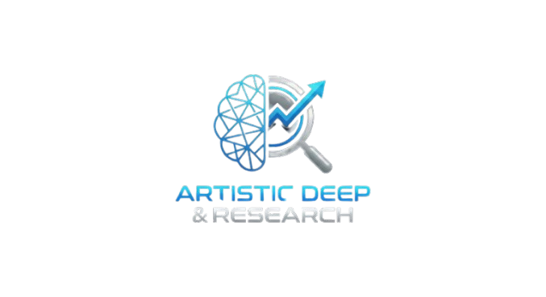
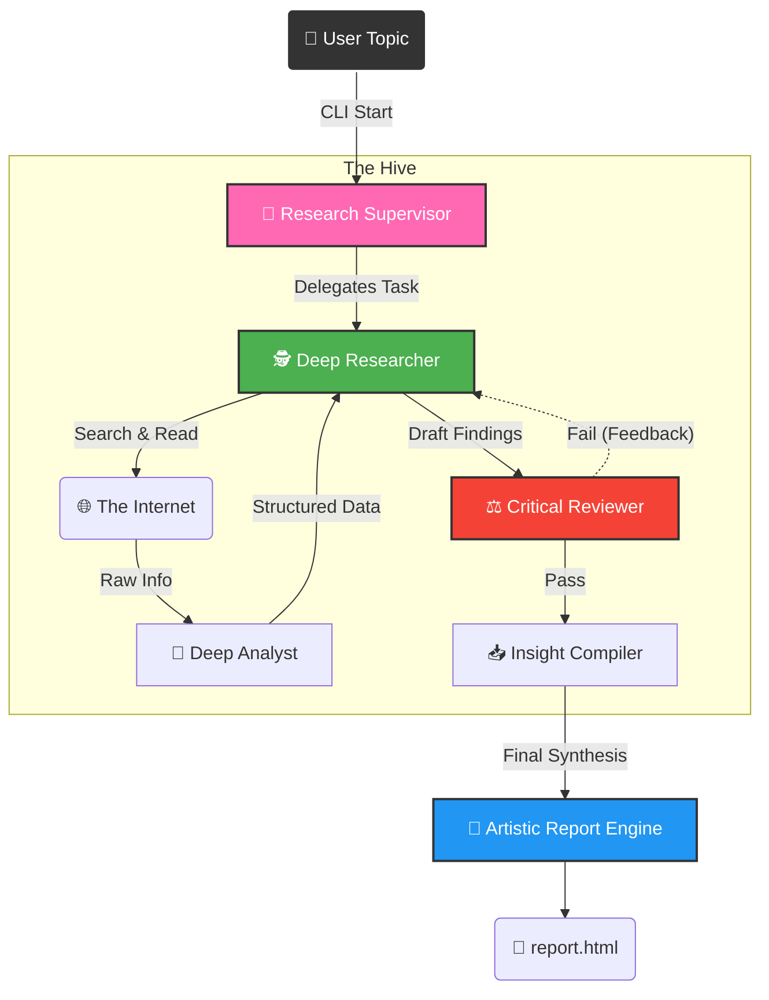

#  Artistic Deep Research

<div align="center">
  <a href="https://www.artisticimpression.org/">
    
  </a>
  
  <br />
  <br />

  [](https://www.artisticimpression.org/)
  [](https://opensource.org/licenses/MIT)
  [](https://www.python.org/downloads/)
  [](https://github.com/astral-sh/ruff)
  [](http://makeapullrequest.com)

  <h1>The Art of Automated Intelligence</h1>
  
  <p align="center">
    <b>A next-generation, open-source research agent that transforms raw data into beautiful, comprehensive, and artistic reports.</b>
    <br />
    <br />
    <a href="https://www.artisticimpression.org/"><strong>Explore the Website »</strong></a>
    <br />
    <br />
    <a href="#-quick-start">🚀 Quick Start</a>
    ·
    <a href="#-architecture">🏗️ Architecture</a>
    ·
    <a href="https://github.com/Rahulchaube1/ArtisticDeepResearch/issues">🐞 Report Bug</a>
    ·
    <a href="https://github.com/Rahulchaube1/ArtisticDeepResearch/issues">✨ Request Feature</a>
  </p>
</div>

---

## 🌟 Overview

**Artistic Deep Research** is not just another research bot; it's a **research artist**. Built on top of the powerful LangGraph framework, it automates the tedious process of deep internet research—finding sources, reading content, synthesizing facts—and presents the findings in a stunningly designed HTML report.

Whether you are an analyst, a student, or a curious mind, Artistic Deep Research empowers you to:
*   **🔎 Dig Deeper**: Iteratively search and reflect on findings to uncover hidden gems.
*   **👁️ See Clearly**: Visualize complex information through structured, aesthetic reports.
*   **⏳ Save Time**: Parallel processing across multiple search engines and models.

> *"Research is seeing what everybody else has seen and thinking what nobody else has thought."*

---

## 🚀 Key Features

| Feature | Description |
| :--- | :--- |
| **🎨 Artistic Reporting** | Generates beautiful HTML reports with custom typography, layouts, and your branding. |
| **🧠 Deep Reflection** | Uses a "Think Tool" to pause, reflect, and plan the next steps in research, just like a human expert. |
| **⚡ Parallel Execution** | Spins up multiple sub-agents to research different aspects of a topic simultaneously. |
| **🔌 Multi-Model Support** | Compatible with **OpenAI**, **Anthropic**, **Google Gemini**, and more via `init_chat_model`. |
| **🌐 Comprehensive Search** | Integrates with **Tavily**, **Exa**, **ArXiv**, **PubMed**, and standard web search. |
| **🛠️ CLI Power** | Robust Command Line Interface with rich progress bars and colorful output. |

---

---
<br />

## 🧠 Brain Architecture

The **Deep Hive** architecture mimics a human research team. It is composed of specialized AI nodes working in harmony.



<br />

## 🧪 Research Examples

Artistic Deep Research can handle complex queries across various domains.

<details>
<summary><b>⚛️ Physics & Science</b></summary>

> **Command**: `python -m Artistic_DeepResearch.cli start --topic "Recent Breakthroughs in Nuclear Fusion 2024-2025"`
>
> **Output**: A detailed breakdown of ITER milestones, private sector investments (Helion, TAE), and Q_plasma achievements.
</details>

<details>
<summary><b>💰 Market Analysis</b></summary>

> **Command**: `python -m Artistic_DeepResearch.cli start --topic "Impact of AI Agents on SaaS Pricing Models"`
>
> **Output**: A comparative analysis of seat-based vs. usage-based pricing, featuring case studies from Salesforce and emerging startups.
</details>

<details>
<summary><b>🏥 Healthcare</b></summary>

> **Command**: `python -m Artistic_DeepResearch.cli start --topic "CRISPR Therapies approved by FDA in 2024"`
>
> **Output**: A timeline of approvals, mechanism of action summaries, and patent landscape analysis.
</details>

<br />

---

## 🏁 Quick Start

### Prerequisites
*   Python 3.10+
*   API Keys for your preferred Model Provider (e.g., OpenAI, Anthropic) and Search Tool (e.g., Tavily).

### Installation

1.  **Clone the Repository**
    ```bash
    git clone https://github.com/Rahulchaube1/ArtisticDeepResearch.git
    cd ArtisticDeepResearch
    ```

2.  **Set Up Environment**
    ```bash
    python -m venv .venv
    # Windows
    .\.venv\Scripts\activate
    # Mac/Linux
    source .venv/bin/activate
    ```

3.  **Install Dependencies**
    ```bash
    pip install -e .
    # If using requirements file:
    pip install -r requirements.txt
    ```

4.  **Configure API Keys**
    Copy the example environment file and add your keys:
    ```bash
    cp .env.example .env
    ```
    *Edit `.env` with your `OPENAI_API_KEY`, `TAVILY_API_KEY`, etc.*

---

## 🎮 Usage

### 1. The Command Line Interface (CLI)

The easiest way to run a research task is via our beautiful CLI:

```bash
python -m Artistic_DeepResearch.cli start --topic "The Future of Quantum Computing"
```

*Watch as the agent plans, searches, reflects, and finally generates a `report.html` in your directory.*

### 2. Customizing the Report

You can modify the aesthetic of the generated reports by editing `src/Artistic_DeepResearch/report_generator.py`. The CSS and HTML templates are fully customizable to match your brand.

---

## ⚙️ Configuration

Artistic Deep Research is highly configurable. You can tweak the behavior in `src/Artistic_DeepResearch/configuration.py`.

| Parameter | Default | Description |
| :--- | :--- | :--- |
| `max_researcher_iterations` | `6` | How deep the rabbit hole goes. Higher = more detailed. |
| `max_concurrent_research_units` | `5` | Number of parallel agents. Higher = faster but more API usage. |
| `search_api` | `tavily` | The search engine backend (tavily, openai, anthropic). |

---

## 🤝 Contributing

We welcome contributions from the community! Whether it's a new "Artistic" theme, a better search tool integration, or a bug fix.

1.  Fork the Project
2.  Create your Feature Branch (`git checkout -b feature/AmazingFeature`)
3.  Commit your Changes (`git commit -m 'Add some AmazingFeature'`)
4.  Push to the Branch (`git push origin feature/AmazingFeature`)
5.  Open a Pull Request

---

## 📄 License

Distributed under the **MIT License**. See `LICENSE` for more information.

---

<div align="center">
  <br />
  <a href="https://www.artisticimpression.org/">
    
  </a>
  <br />
  <h3>Built with ❤️ by <a href="https://github.com/Rahulchaube1">Rahul Chaube</a></h3>
  <p>&copy; 2025 Rahul Chaube. All Rights Reserved.</p>
</div>
